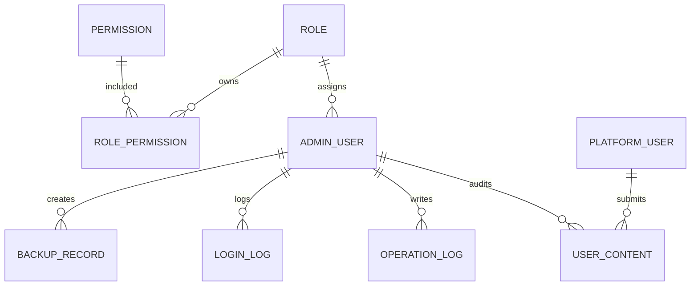

# 海外藏中国文物知识管理与服务平台后台子系统数据库设计

## 1. 数据库概述

本数据库用于支撑“海外藏中国文物知识管理与服务平台”的后台管理子系统，主要覆盖文物数据维护、平台用户管理、后台管理员管理、角色权限配置、内容审核、敏感词管理、日志审计和备份记录管理。

- 数据库名称：`admin_management_system`
- 字符集：`utf8mb4`
- 排序规则：`utf8mb4_general_ci`
- 数据库类型：MySQL
- 初始化脚本：`sql/init.sql`
- 后端连接配置：`backend/src/main/resources/application.yml`

数据库连接配置：

```yaml
spring:
  datasource:
    url: jdbc:mysql://localhost:3306/admin_management_system?useUnicode=true&characterEncoding=utf8&serverTimezone=Asia/Shanghai&useSSL=false&allowPublicKeyRetrieval=true
    username: root
    password: 123456
```

## 2. 表结构总览

| 表名 | 中文名称 | 主要用途 |
| --- | --- | --- |
| `artifact` | 文物数据表 | 存储海外馆藏中国文物基础数据 |
| `admin_user` | 后台管理员表 | 存储后台登录账号和角色 |
| `role` | 角色表 | 存储后台角色 |
| `permission` | 权限表 | 存储系统权限点 |
| `role_permission` | 角色权限关联表 | 维护角色和权限的多对多关系 |
| `platform_user` | 平台普通用户表 | 存储前台平台用户信息和管控状态 |
| `user_content` | 用户生成内容表 | 存储评论、图片、音视频、帖子等待审内容 |
| `sensitive_word` | 敏感词表 | 存储敏感词及启停状态 |
| `operation_log` | 操作日志表 | 记录后台关键操作 |
| `login_log` | 登录日志表 | 记录后台登录成功和失败信息 |
| `backup_record` | 备份记录表 | 记录系统备份操作 |

## 3. 实体关系说明

核心关系如下：



说明：

- 一个后台管理员属于一个角色。
- 一个角色可以拥有多个权限，一个权限也可以分配给多个角色。
- 一个平台用户可以提交多条用户内容。
- 用户内容可以由后台管理员审核。
- 登录日志、操作日志、备份记录用于系统审计。

## 4. 表结构设计

### 4.1 文物数据表 artifact

用途：保存海外博物馆馆藏中国文物数据，是系统的核心业务表。

| 字段名 | 类型 | 约束 | 说明 |
| --- | --- | --- | --- |
| `id` | BIGINT | 主键，自增 | 数据库主键 |
| `object_id` | VARCHAR(100) | 非空，唯一 | 文物唯一标识符 |
| `title` | VARCHAR(255) | 非空 | 文物名称 |
| `period` | VARCHAR(255) | 非空 | 年代/时期 |
| `type` | VARCHAR(100) | 非空 | 文物类型 |
| `material` | VARCHAR(255) | 默认空字符串 | 材质 |
| `description` | TEXT | 非空 | 文物介绍 |
| `dimensions` | VARCHAR(255) | 默认空字符串 | 尺寸 |
| `museum` | VARCHAR(255) | 非空 | 所属博物馆 |
| `location` | VARCHAR(255) | 非空 | 博物馆所在地 |
| `detail_url` | VARCHAR(800) | 非空 | 文物详情页 URL |
| `image_url` | VARCHAR(800) | 非空 | 图片原始链接 |
| `image_path` | VARCHAR(800) | 非空 | 本地图片存储路径 |
| `credit_line` | VARCHAR(500) | 默认空字符串 | 版权/来源说明 |
| `accession_number` | VARCHAR(255) | 默认空字符串 | 藏品编号 |
| `crawl_date` | DATE | 非空 | 爬取日期 |
| `audit_status` | TINYINT | 默认 1 | 数据状态：0 待审核，1 已发布，2 已下架 |
| `kg_sync_status` | TINYINT | 默认 0 | 知识图谱同步状态：0 未同步，1 已同步，2 同步失败 |
| `create_time` | DATETIME | 默认当前时间 | 创建时间 |
| `update_time` | DATETIME | 自动更新时间 | 更新时间 |

索引设计：

| 索引名 | 字段 | 类型 | 说明 |
| --- | --- | --- | --- |
| `uk_artifact_object_id` | `object_id` | 唯一索引 | 防止重复采集同一文物 |
| `idx_artifact_title` | `title` | 普通索引 | 支持按标题查询 |
| `idx_artifact_period` | `period` | 普通索引 | 支持按年代查询 |
| `idx_artifact_type` | `type` | 普通索引 | 支持按类型查询 |
| `idx_artifact_museum` | `museum` | 普通索引 | 支持按博物馆查询 |

对应后端实体：

```text
com.buct.backend.entity.Artifact
```

对应主要接口：

```text
/api/admin/artifacts/page
/api/admin/artifacts/{id}
/api/admin/artifacts
```

### 4.2 角色表 role

用途：保存后台系统角色。

| 字段名 | 类型 | 约束 | 说明 |
| --- | --- | --- | --- |
| `id` | BIGINT | 主键，自增 | 角色 ID |
| `role_name` | VARCHAR(100) | 非空 | 角色名称 |
| `role_code` | VARCHAR(100) | 非空，唯一 | 角色编码 |
| `description` | VARCHAR(255) | 默认空字符串 | 角色说明 |
| `create_time` | DATETIME | 默认当前时间 | 创建时间 |

默认角色：

| 角色编码 | 角色名称 | 说明 |
| --- | --- | --- |
| `SUPER_ADMIN` | 超级管理员 | 拥有全部操作权限 |
| `CONTENT_REVIEWER` | 内容审核员 | 仅拥有内容审核相关权限 |
| `DATA_ADMIN` | 数据管理员 | 拥有文物数据增删改查权限 |
| `NORMAL_USER` | 普通用户 | 仅拥有基础查看权限 |

### 4.3 权限表 permission

用途：保存系统内可分配的权限点。

| 字段名 | 类型 | 约束 | 说明 |
| --- | --- | --- | --- |
| `id` | BIGINT | 主键，自增 | 权限 ID |
| `permission_name` | VARCHAR(100) | 非空 | 权限名称 |
| `permission_code` | VARCHAR(100) | 非空，唯一 | 权限编码 |
| `module_name` | VARCHAR(100) | 非空 | 所属模块 |
| `description` | VARCHAR(255) | 默认空字符串 | 权限说明 |

默认权限：

| 权限编码 | 权限名称 | 所属模块 |
| --- | --- | --- |
| `artifact:view` | 查看文物 | 文物管理 |
| `artifact:add` | 新增文物 | 文物管理 |
| `artifact:edit` | 编辑文物 | 文物管理 |
| `artifact:delete` | 删除文物 | 文物管理 |
| `artifact:import` | 导入文物 | 文物管理 |
| `artifact:export` | 导出文物 | 文物管理 |
| `user:view` | 查看用户 | 用户管理 |
| `user:status` | 管理用户状态 | 用户管理 |
| `content:view` | 查看审核内容 | 内容审核 |
| `content:review` | 审核内容 | 内容审核 |
| `log:view` | 查看日志 | 日志管理 |
| `dashboard:view` | 查看看板 | 系统看板 |

### 4.4 角色权限关联表 role_permission

用途：维护角色和权限之间的多对多关系。

| 字段名 | 类型 | 约束 | 说明 |
| --- | --- | --- | --- |
| `id` | BIGINT | 主键，自增 | 主键 ID |
| `role_id` | BIGINT | 非空 | 角色 ID |
| `permission_id` | BIGINT | 非空 | 权限 ID |

索引设计：

| 索引名 | 字段 | 类型 | 说明 |
| --- | --- | --- | --- |
| `uk_role_permission` | `role_id`, `permission_id` | 唯一索引 | 防止同一角色重复分配同一权限 |

默认分配关系：

| 角色 | 默认权限 |
| --- | --- |
| 超级管理员 | 全部权限 |
| 内容审核员 | 查看审核内容、审核内容、查看看板 |
| 数据管理员 | 查看文物、新增文物、编辑文物、删除文物、导入文物、导出文物、查看看板 |
| 普通用户 | 查看文物、查看看板 |

对应主要接口：

```text
/api/admin/roles
/api/admin/roles/{roleId}/permissions
/api/admin/permissions
```

### 4.5 后台管理员表 admin_user

用途：保存后台管理系统登录账号。

| 字段名 | 类型 | 约束 | 说明 |
| --- | --- | --- | --- |
| `id` | BIGINT | 主键，自增 | 管理员 ID |
| `username` | VARCHAR(100) | 非空，唯一 | 管理员用户名 |
| `password` | VARCHAR(255) | 非空 | 管理员密码 |
| `real_name` | VARCHAR(100) | 默认空字符串 | 真实姓名 |
| `role_id` | BIGINT | 非空 | 角色 ID |
| `status` | TINYINT | 默认 1 | 账号状态：0 禁用，1 启用 |
| `last_login_time` | DATETIME | 可空 | 最后登录时间 |
| `create_time` | DATETIME | 默认当前时间 | 创建时间 |
| `update_time` | DATETIME | 自动更新时间 | 更新时间 |

索引设计：

| 索引名 | 字段 | 类型 | 说明 |
| --- | --- | --- | --- |
| `uk_admin_username` | `username` | 唯一索引 | 防止管理员用户名重复 |

初始账号：

| 用户名 | 密码 | 真实姓名 | 角色 |
| --- | --- | --- | --- |
| `admin` | `123456` | 系统管理员 | 超级管理员 |
| `reviewer` | `123456` | 内容审核员 | 内容审核员 |
| `dataadmin` | `123456` | 数据管理员 | 数据管理员 |

说明：当前课程设计版本密码为明文存储，便于本地验收演示；正式生产环境应改为 BCrypt 等不可逆加密方式。

### 4.6 平台普通用户表 platform_user

用途：保存前台平台普通用户信息，并支持后台对用户进行禁用、禁评、禁传等管控。

| 字段名 | 类型 | 约束 | 说明 |
| --- | --- | --- | --- |
| `id` | BIGINT | 主键，自增 | 用户 ID |
| `username` | VARCHAR(100) | 非空 | 用户名 |
| `email` | VARCHAR(100) | 默认空字符串 | 邮箱 |
| `phone` | VARCHAR(30) | 默认空字符串 | 手机号 |
| `avatar` | VARCHAR(800) | 默认空字符串 | 头像 URL |
| `source` | VARCHAR(50) | 默认 `WEB` | 用户来源：`WEB` 或 `APP` |
| `status` | TINYINT | 默认 1 | 账号状态：0 禁用，1 启用 |
| `ban_comment` | TINYINT | 默认 0 | 是否禁止评论：0 否，1 是 |
| `ban_upload` | TINYINT | 默认 0 | 是否禁止上传：0 否，1 是 |
| `create_time` | DATETIME | 默认当前时间 | 创建时间 |
| `comment_banned` | TINYINT | 默认 0 | 兼容字段：是否禁止评论 |
| `upload_banned` | TINYINT | 默认 0 | 兼容字段：是否禁止上传 |
| `register_time` | DATETIME | 默认当前时间 | 注册时间 |
| `update_time` | DATETIME | 自动更新时间 | 更新时间 |

说明：当前后端实体和接口主要使用 `ban_comment`、`ban_upload` 字段进行禁评、禁传控制，`comment_banned`、`upload_banned` 为兼容字段。

### 4.7 用户生成内容表 user_content

用途：保存平台用户提交的评论、图片、音频、视频、帖子等内容，并支持后台审核。

| 字段名 | 类型 | 约束 | 说明 |
| --- | --- | --- | --- |
| `id` | BIGINT | 主键，自增 | 内容 ID |
| `user_id` | BIGINT | 非空 | 提交用户 ID |
| `artifact_object_id` | VARCHAR(100) | 默认空字符串 | 关联文物 `object_id` |
| `content_type` | VARCHAR(50) | 非空 | 内容类型：`COMMENT`、`IMAGE`、`AUDIO`、`VIDEO`、`POST` |
| `content_text` | TEXT | 可空 | 文本内容 |
| `file_url` | VARCHAR(800) | 默认空字符串 | 文件 URL |
| `source` | VARCHAR(50) | 默认 `WEB` | 来源：`WEB` 或 `APP` |
| `audit_status` | TINYINT | 默认 0 | 审核状态：0 待审核，1 通过，2 拒绝，3 复审 |
| `reject_reason` | VARCHAR(500) | 默认空字符串 | 拒绝原因 |
| `submit_time` | DATETIME | 默认当前时间 | 提交时间 |
| `audit_time` | DATETIME | 可空 | 审核时间 |
| `auditor_id` | BIGINT | 可空 | 审核员 ID |

审核状态说明：

| 状态值 | 含义 |
| --- | --- |
| 0 | 待审核 |
| 1 | 审核通过 |
| 2 | 审核拒绝 |
| 3 | 复审 |

对应主要接口：

```text
/api/admin/content/audit/page
/api/admin/content/audit/{id}/approve
/api/admin/content/audit/{id}/reject
/api/admin/content/audit/{id}/recheck
```

### 4.8 敏感词表 sensitive_word

用途：维护内容审核使用的敏感词。

| 字段名 | 类型 | 约束 | 说明 |
| --- | --- | --- | --- |
| `id` | BIGINT | 主键，自增 | 敏感词 ID |
| `word` | VARCHAR(100) | 非空，唯一 | 敏感词 |
| `status` | TINYINT | 默认 1 | 状态：0 停用，1 启用 |
| `create_time` | DATETIME | 默认当前时间 | 创建时间 |

索引设计：

| 索引名 | 字段 | 类型 | 说明 |
| --- | --- | --- | --- |
| `uk_sensitive_word` | `word` | 唯一索引 | 防止敏感词重复 |

### 4.9 操作日志表 operation_log

用途：记录后台管理员对系统数据进行的关键操作，支持审计追踪。

| 字段名 | 类型 | 约束 | 说明 |
| --- | --- | --- | --- |
| `id` | BIGINT | 主键，自增 | 日志 ID |
| `admin_id` | BIGINT | 可空 | 管理员 ID |
| `admin_username` | VARCHAR(100) | 默认空字符串 | 管理员用户名 |
| `module_name` | VARCHAR(100) | 非空 | 模块名称 |
| `operation_type` | VARCHAR(100) | 非空 | 操作类型 |
| `target_type` | VARCHAR(100) | 默认空字符串 | 操作对象类型 |
| `target_id` | VARCHAR(100) | 默认空字符串 | 操作对象 ID |
| `before_data` | TEXT | 可空 | 操作前数据 |
| `after_data` | TEXT | 可空 | 操作后数据 |
| `ip_address` | VARCHAR(100) | 默认空字符串 | IP 地址 |
| `operation_time` | DATETIME | 默认当前时间 | 操作时间 |

### 4.10 登录日志表 login_log

用途：记录后台登录行为，包括成功登录和失败登录。

| 字段名 | 类型 | 约束 | 说明 |
| --- | --- | --- | --- |
| `id` | BIGINT | 主键，自增 | 登录日志 ID |
| `admin_id` | BIGINT | 可空 | 管理员 ID |
| `username` | VARCHAR(100) | 非空 | 登录用户名 |
| `login_status` | TINYINT | 非空 | 登录状态：0 失败，1 成功 |
| `ip_address` | VARCHAR(100) | 默认空字符串 | IP 地址 |
| `fail_reason` | VARCHAR(255) | 默认空字符串 | 失败原因 |
| `login_time` | DATETIME | 默认当前时间 | 登录时间 |

### 4.11 备份记录表 backup_record

用途：记录后台触发的数据备份操作。

| 字段名 | 类型 | 约束 | 说明 |
| --- | --- | --- | --- |
| `id` | BIGINT | 主键，自增 | 备份记录 ID |
| `backup_name` | VARCHAR(255) | 非空 | 备份名称 |
| `backup_type` | VARCHAR(50) | 非空 | 备份类型：`FULL` 全量，`PARTIAL` 部分 |
| `file_path` | VARCHAR(800) | 默认空字符串 | 备份文件路径 |
| `file_size` | VARCHAR(100) | 默认空字符串 | 文件大小 |
| `operator_id` | BIGINT | 可空 | 操作人 ID |
| `status` | TINYINT | 默认 1 | 备份状态：0 失败，1 成功 |
| `create_time` | DATETIME | 默认当前时间 | 创建时间 |

## 5. 状态字段汇总

| 表名 | 字段 | 取值说明 |
| --- | --- | --- |
| `artifact` | `audit_status` | 0 待审核，1 已发布，2 已下架 |
| `artifact` | `kg_sync_status` | 0 未同步，1 已同步，2 同步失败 |
| `admin_user` | `status` | 0 禁用，1 启用 |
| `platform_user` | `status` | 0 禁用，1 启用 |
| `platform_user` | `ban_comment` | 0 允许评论，1 禁止评论 |
| `platform_user` | `ban_upload` | 0 允许上传，1 禁止上传 |
| `user_content` | `audit_status` | 0 待审核，1 通过，2 拒绝，3 复审 |
| `sensitive_word` | `status` | 0 停用，1 启用 |
| `login_log` | `login_status` | 0 失败，1 成功 |
| `backup_record` | `status` | 0 失败，1 成功 |

## 6. 初始化数据说明

`sql/init.sql` 会初始化以下演示数据：

1. 创建数据库 `admin_management_system`。
2. 创建全部业务表。
3. 写入 4 个默认角色。
4. 写入 12 个默认权限点。
5. 建立角色和权限的默认关联。
6. 写入 3 个后台测试账号。
7. 写入若干文物、平台用户、用户内容、敏感词、日志、备份记录示例数据。

后台测试账号：

| 用户名 | 密码 | 角色 |
| --- | --- | --- |
| `admin` | `123456` | 超级管理员 |
| `reviewer` | `123456` | 内容审核员 |
| `dataadmin` | `123456` | 数据管理员 |

## 7. 数据库导入步骤

在 MySQL 中执行初始化脚本：

```sql
SOURCE C:/Users/camellia/Documents/计算机网络/admin-management-system-hjj-check-20260529165927/admin-management-system-hjj/sql/init.sql;
```

也可以在 IntelliJ IDEA 的 Database 工具窗口中连接 MySQL 后打开 `sql/init.sql` 并执行。

导入完成后可检查主要表：

```sql
USE admin_management_system;
SHOW TABLES;
SELECT * FROM admin_user;
SELECT * FROM role;
SELECT * FROM permission;
```

## 8. 设计特点

### 8.1 面向后台管理场景

数据库围绕后台管理常见模块进行设计，包括基础数据、账号权限、内容审核、日志审计和备份管理，能够支撑课程验收中要求的增删改查和管理展示。

### 8.2 支持角色权限扩展

角色和权限采用独立表加关联表的方式设计，后续可以继续新增角色、权限点，并通过 `role_permission` 灵活分配。

### 8.3 支持文物数据检索

文物表对 `object_id`、`title`、`period`、`type`、`museum` 等字段建立索引，便于后台按文物名称、年代、类型、博物馆进行筛选。

### 8.4 支持内容审核闭环

`user_content` 表保存内容状态、拒绝原因、审核时间和审核员 ID，可以完整记录从提交到审核通过、拒绝或复审的流程。

### 8.5 支持审计追踪

`operation_log` 和 `login_log` 分别记录后台操作和登录行为，能够用于验收展示中的日志审计模块。

## 9. 后续可优化方向

当前数据库已满足课程设计和本地验收演示需要。若继续扩展为生产系统，可考虑：

1. 为所有逻辑外键增加数据库外键约束，提升数据一致性。
2. 管理员密码改为 BCrypt 加密存储。
3. 为高频查询字段增加组合索引，例如文物类型和年代组合查询。
4. 为操作日志和登录日志增加定期归档机制。
5. 将 `platform_user` 中的兼容禁用字段统一，减少冗余字段。
6. 增加知识图谱同步记录表，保存每次同步任务的明细。
